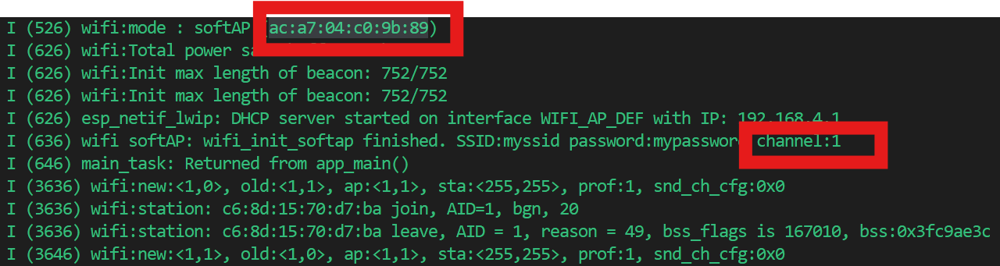
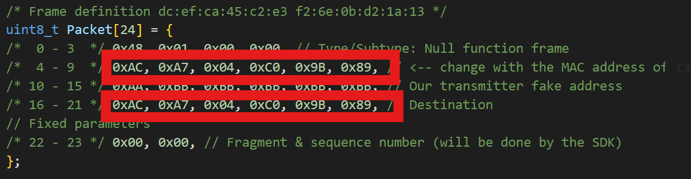
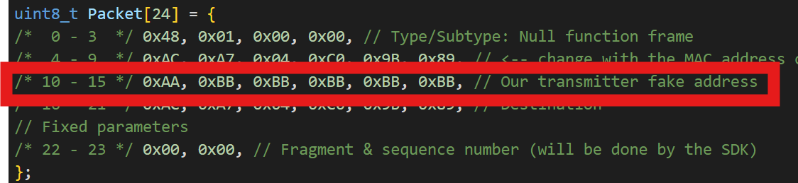
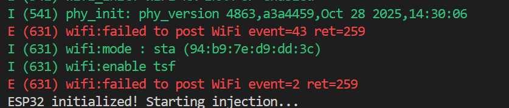
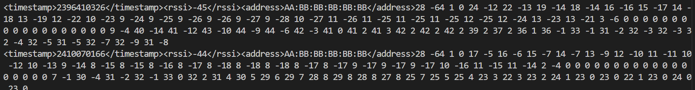

# Lab 3: WiFi CSI Sensing — Presence Detection **IoT**{: .label .label-iot }

Date: TBD
TA: TBD
Hardware: ESP32 boards (x3 per group: softAP, injector, sniffer), personal laptop (Windows, macOS, or Linux)
Total time: About 4 hours

## Goals

By the end of this lab, each group should be able to:

- explain basic WiFi concepts: frames, channels, and OFDM subcarriers;
- explain what channel state information (CSI) is and why it varies with the environment;
- recognize the structure of an 802.11 frame from a live Wireshark screenshot;
- flash and configure the three ESP32 roles: access point (softAP), injector (TX), and sniffer (CSI receiver);
- extract and visualize raw CSI amplitude/phase data per subcarrier;
- detect human presence and motion from CSI using variance/energy thresholding;
- discuss the limitations of WiFi sensing (multipath, motion artifacts, distance sensitivity).

## Hardware

For this lab, the most relevant board facts are:

| Item | Value |
| --- | --- |
| Board | ESP32, running this repo's firmware (`softAP`, `injector`, `sniffer`) |
| Roles per group | 1x softAP (access point), 1x injector (TX stimulus), 1x sniffer (CSI receiver) |
| WiFi band / channel | 2.4 GHz, channel 1 |
| Debug/flashing | USB (UART) |
| Interfaces | Serial output for CSI logs (sniffer); USB for flashing |
| Intended use here | Generates and captures CSI for presence sensing |

Official/reference materials (TA to confirm final links before lab):

- This repo's ESP32 firmware: [`softAP/`](softAP/), [`injector/`](injector/), [`sniffer/`](sniffer/)
- The Python CSI tools in [`tools/`](tools/) — live visualization and presence detection
- Espressif ESP-IDF flashing tools
- Wireshark (used for the instructor demo only)


## Before Lab

TA setup should prepare:

- one softAP, one injector, and one sniffer ESP32 per group, pre-labeled;
- USB cables for all three boards per group;
- pre-built firmware images for the softAP, injector, and sniffer roles (built from this repo);
- the `tools/` scripts available to students (and any optional analysis notebooks);
- one shared pre-captured `.pcap` file of ambient WiFi traffic for the Wireshark instructor demo (should include at least one beacon frame and one data exchange);
- a fallback set of pre-recorded CSI logs (empty-room and motion scenes) that groups can replay with `csi_presence_detect.py --replay` if live capture fails;
- a quiet area or physical partition per group to reduce CSI cross-talk between groups' links;
- a few spare pre-flashed boards (one per role) so a group with a misbehaving board can swap rather than wait on a re-flash.

## Environment Setup

Complete the **[Environment Setup guide](environment-setup.md)** before lab day. It covers ESP-IDF installation, USB driver setup, Python virtual environment creation, and a final verification checklist. Estimated time: 30–60 minutes.

TAs should circulate the setup guide at least a few days before the lab and offer an office-hours slot for students who get stuck. Ask students to confirm the verification checklist is passing before they arrive.

## Lab Code

Use the public IMU lab repository as the source of truth:

[https://github.com/LuHaofan/wifi_lab](https://github.com/LuHaofan/wifi_lab)

Clone it once:

```bash
git clone https://github.com/LuHaofan/wifi_lab.git
cd wifi_lab
```

## Python Setup

Open a terminal in the lab code folder:

```bash
cd wifi_lab/tools
```

Create a Python environment if you have not already done so.

macOS/Linux:

```bash
python3 -m venv .venv
source .venv/bin/activate
python -m pip install --upgrade pip
python -m pip install -r requirements.txt
```

Windows PowerShell:

```powershell
python -m venv .venv
.\.venv\Scripts\Activate.ps1
python -m pip install --upgrade pip
python -m pip install -r requirements.txt
```

Find the ESP32 serial port.

macOS:

```bash
ls /dev/cu.usb* /dev/cu.SLAB* /dev/cu.wch* 2>/dev/null
```

Windows:

```text
Open Device Manager -> Ports (COM & LPT), then look for the new COM port.
```

Use your actual port in the commands below. Examples:

- macOS: `/dev/cu.usbserial-5B1F0080901`
- Windows: `COM5`

---

## Part A: WiFi Fundamentals Review

### 0:00–0:20 — WiFi and CSI Concepts

WiFi sensing relies on how a transmitted signal's channel response changes as it travels through the environment:

`CSI = how the channel (paths, reflections, obstacles) modifies the transmitted signal`

Unlike RSSI (a single power value), CSI gives per-subcarrier amplitude and phase information, making it sensitive to fine-grained environmental changes — including moving bodies and, in the extension, breathing.

Key terms:

- **Frame:** the basic unit of data exchanged over WiFi (management, control, data).
- **Channel:** a frequency band WiFi operates on (e.g. channels 1, 6, 11 in 2.4 GHz).
- **OFDM / Subcarrier:** OFDM divides a channel into many narrow subcarriers; CSI is reported per subcarrier.
- **Multipath:** signal arriving at the receiver via multiple reflected paths; CSI captures how energy is spread across those paths.
- **RSSI vs. CSI:** RSSI tells you how loud the signal is; CSI tells you how the signal was shaped by the environment on each subcarrier.

> **Key takeaway:** Your router is constantly sending signals that bounce off everything in the room — including you. CSI is a way to read those distortions and infer what changed in the environment, without a camera or any wearable sensor.

### 0:20–0:35 — Wireshark Frame Demo (Instructor-Led)

The TA projects a live Wireshark window with the shared `.pcap` file open. Students follow along on their own laptops.

1. TA identifies a beacon frame: point out SSID, channel, and beacon interval.
2. TA identifies a data frame: point out frame type, source/destination MAC, and sequence number.
3. Students open the same `.pcap` on their own laptop and locate one beacon frame independently.

This is a brief visual reference — no hands-on tasks beyond opening the file. The goal is to make the concept of "frames" concrete before the ESP32 starts producing them.

> **Key takeaway:** WiFi traffic is structured and readable — every packet has a header that tells you who sent it, what type it is, and where it's going. The TX ESP32 in this lab is producing exactly this kind of traffic.

### 0:35–0:55 — WiFi Sensing Fundamentals

Explain why WiFi CSI changes with environment, and how it could be used for sensing. Instructor slides presentation

### 0:55–1:05 — Break + Buffer

*10-minute break. TAs use the remaining buffer to circulate and check any environment setup issues before hardware work begins.*

### 1:05–2:00 — ESP32 Setup 

#### SoftAP Setup
0. Change dir to the softAP project:
```
cd softAP
```
1. Connect one ESP32 board by USB to the laptop (mark it as "AP")
2. Identify its serial port (COM on Windows; `/dev/ttyUSB*` or `/dev/ttyACM*` on Linux; `/dev/cu.*` on macOS). Since there is only one board, the one you detect should be the right one. 

3. Set the channel for the AP:
In `main/sdkconfig.h` line 339,
```
#define CONFIG_ESP_WIFI_CHANNEL 1
```
modify the value `1` to any number between 1-12, and note it.

3. Build, flash and monitor: bring up command palette: `Ctrl + Shift + P`, search `Build, Flash and Start a Monitor on Your Device`. A termnial will pop up and starts working. When it's done, you will see the following message in the terminal:


4. Note the channel is `1`, and MAC address: `ac:a7:04:c0:9b:89`. Yours will be different.

**Question 1**: Your AP's MAC address is:

**Question 2**: Your AP's channel is:

5. AP is now setup, you can unplug it from your laptop, and put it on power at a power outlet.

#### Injector Setup
0. Change dir to the injector project:
```
cd ../injector
```
1. Connect another ESP32 boards by USB (mark it as "injector").
2. Identify the board's serial port.
3. Set the MAC Address. In `main/injector.c`, change the MAC addresses in the packet:

4-9, 16-21 must be the same and match the AP's MAC address noted above.
10-15 can be any 6-byte address. Please come up with something unique, and take a note of the one your select:

4. Set the channel. In `main/injector.c` line 51, change the first number of the channel number you selected above.
```
ESP_ERROR_CHECK(esp_wifi_set_channel(<channel number you selected>, 0));
```
5. Build, Flash and Monitor the `injector` firmware to the board. When it's done, in the terminal, you will see:


**Question 3:** the injector's *fake* MAC address is:

6. Injector is now setup, you can unplug it from your laptop, and put it on power at a power outlet.

#### Sniffer Setup
0. Change dir to the sniffer project:
```
cd ../sniffer
```
1. Connect another ESP32 boards by USB (mark it as "injector").
2. Identify the board's serial port.
3. Set the MAC Address. In `main/sniffer.c` line 13, change the MAC addresses to the fake address you selected:
```
#define INJECTOR_SPOOFED_MAC "AA:BB:BB:BB:BB:BB"
```
4. Set the channel. In `main/sniffer.c` line 79, change the first number of the channel number you selected above.
```
ESP_ERROR_CHECK(esp_wifi_set_channel(<channel_number_you_selected>, 0)); // <-- Change the channel
```
4. Build, Flash and Monitor. the `sniffer` firmware to the board.When it's done, in the terminal, you will see:


Checkpoint: show the TA one live CSI output line on the sniffer's serial monitor before moving on.

---

## Part B: CSI Analysis and Presence Detection

This part uses the `tools/` scripts. If live capture is not working for a group, replay a fallback CSI log with `csi_presence_detect.py --replay <file>` and continue with analysis only.

### 2:00–2:50 — CSI Extraction and Visualization

1. Watch live CSI with `python tools/plot_csi_serial.py --port <SNIFFER_PORT>`. The top panel is a subcarrier × time amplitude heatmap; the bottom panel plots one selectable subcarrier's amplitude over time.
2. To capture a scene for offline review, log the raw serial stream: `python tools/csi_presence_detect.py --port <SNIFFER_PORT> --log scene.txt`. Replay it later with `--replay scene.txt`.
3. Understand the data: the sniffer emits raw CSI as int8 `(I, Q)` pairs per subcarrier (64 subcarriers). The tools convert each to amplitude = `sqrt(I² + Q²)`. Phase = `atan2(Q, I)` is available in the same data for the phase extension.

> The `--log` file stores the raw tagged serial lines (one per CSI report), so it is an exact record of the session. An optional analysis notebook can parse those lines into a tidy table (`timestamp, subcarrier_index, amplitude, phase, rssi`) for custom plots.

Collect two short scenes (30 seconds each):

| Scene | Description |
| --- | --- |
| static | room empty, nobody near the TX–RX link |
| motion | a student walks or waves an arm near the TX–RX link |

Look at:
- amplitude over time for one subcarrier, with the static and motion periods visible — pick a subcarrier in `plot_csi_serial.py`'s dropdown and watch its bottom-panel trace.


**Question 4:** Which subcarriers show the most variation when someone moves?

> **Key takeaway:** Motion shows up as variance — the signal wiggles more when something moves near the TX–RX link, even if RSSI barely changes. Visualizing CSI turns an abstract matrix of numbers into something you can directly see and interpret.

### 2:50–3:00 — Break

### 3:00–3:50 — Presence Detection

The presence detector is `tools/csi_presence_detect.py`. It keeps a sliding window of recent CSI amplitude vectors, computes a motion score from their variance across subcarriers, and thresholds it into a live **MOTION / NO MOTION** verdict with a scrolling score plot. The same tool runs live (`--port`) or offline on a recorded log (`--replay`).

**Coding task:** the core of the detector — `MotionDetector.update()` — ships incomplete. Implement it: keep the most recent `--window-size` amplitude vectors, compute the variance of each subcarrier over that window, average those per-subcarrier variances into a single score, and return motion = (score > threshold). See the TODO comment in the file.

Collect two scenes for 60 seconds each:

| Scene | Description |
| --- | --- |
| empty | no person near the injector–sniffer link |
| present | a student stands still, then walks, then stands still again near the link |

Run the detector on each scene, for example:

```bash
python tools/csi_presence_detect.py --port <SNIFFER_PORT> --log present.txt --threshold 2.0 --window-size 20
python tools/csi_presence_detect.py --replay present.txt   # re-run offline, identical result
```

Suggested features (what your `update()` computes):

- per-window variance of amplitude, averaged across subcarriers (the default);
- per-window energy (sum of squared amplitude deviations from a short rolling baseline).

Look at:

- the motion-score time series with the threshold line marked (the tool draws both);
- the empty scene vs. the presence scene — compare where each crosses the threshold.

Experiment with the threshold (`--threshold`) and window (`--window-size`):

- Lower the threshold: does the detector become more sensitive? Does it start triggering on nothing?
- Raise it: does it miss the person entering?

Discussion prompts:

- At what threshold do you start getting false positives during the empty scene?
- Does standing still look the same as walking? What about sitting down vs. standing up?
- What would happen if two groups' TX/RX links were pointing at each other?
- Where do you think this approach would break down in a real home or office?

Checkpoint: demonstrate to the TA that your detector correctly flags a group member walking into the sensing area at least 3 out of 5 times.

> **Key takeaway:** A simple variance threshold is enough to detect a human entering a room — no camera, no wearable, just a WiFi signal. But there is a real tradeoff between sensitivity (catching motion) and specificity (avoiding false alarms), and that tradeoff depends on the environment. This is the same core idea behind commercial WiFi sensing products, just with more engineering on top.

### 3:50–4:00 — Wrap-up

Compare presence detection performance and threshold choices across groups. Discuss what setup differences (board distance, antenna angle, room layout, other WiFi traffic) explain the variation in results.

Discussion prompts:

- If you were deploying this in a real building, what would you worry about?
- What would you change about the setup to make the detector more robust?

---

## Deliverables

Submit one short report per group with:

1. The serial port/firmware table for the softAP, injector, and sniffer boards (with a screenshot of a live CSI line).
2. One CSI amplitude profile plot (subcarrier index vs. amplitude, static snapshot).
3. One amplitude-over-time plot showing the static and motion periods on the same axis.
4. The presence detection variance/energy time series plot with threshold marked, for both the empty and presence scenes.
5. A brief description of how you chose your threshold and what happened when you adjusted it.
6. Answers to the discussion prompts from each module.

---

## Conclusion

- CSI carries richer information than RSSI because it reports per-subcarrier amplitude and phase, making it sensitive to fine-grained changes in the environment.
- Human presence and motion can be detected from CSI using simple variance/energy thresholding — no cameras, no wearables, no direct contact with the person.
- There is a fundamental tradeoff between sensitivity and specificity when setting a detection threshold, and the right threshold depends on the environment.
- WiFi sensing accuracy depends heavily on geometry, antenna placement, and ambient interference from other people or other WiFi networks.

---

## Extension: Breathing Rate Estimation (After-Class Self-Exploration)

This extension goes beyond the in-lab session and is intended for students who want to explore further on their own. It uses the same hardware and notebook environment set up during the lab.

The idea: when a person sits very still near the TX–RX link, their breathing causes tiny, periodic changes in CSI amplitude. Those changes are small (much smaller than walking) but they repeat at a regular rate — typically 12–20 breaths per minute for a resting adult. A bandpass filter isolates that frequency band, and an FFT reveals the dominant breathing frequency as a peak in the power spectrum.

### Setup

- Position the sniffer close to where the person will sit (within 1–2 meters of the direct injector–sniffer path).
- The person should sit as still as possible for 60 seconds and breathe normally.
- Record CSI from the sniffer to a log file (`csi_presence_detect.py --port <SNIFFER_PORT> --log breathing.txt`).

### Steps

1. Load the 60-second log into the TA-provided notebook.
2. Select the subcarrier(s) with the clearest periodic variation (plot a few and compare visually).
3. Apply the provided bandpass filter, tuned to the breathing rate range (roughly 0.1–0.5 Hz, i.e. 6–30 breaths/min). Adjust the cutoffs if needed.
4. Compute the FFT of the filtered amplitude signal.
5. Identify the dominant peak frequency and convert to breaths per minute:
   `breaths_per_min = peak_frequency_Hz * 60`
6. Manually count your breaths over the same 60-second recording and compare.

### Plots to produce

- raw amplitude trace for the chosen subcarrier;
- filtered amplitude trace;
- power spectrum with the detected breathing-rate peak marked and labelled in breaths/min.

### Things to explore

- Does the estimated rate change if you use a different subcarrier?
- What happens if you move slightly during the recording?
- Can you detect two people breathing at different rates at the same time?
- How close do you need to be to the TX–RX link for a clean estimate?

> **Key takeaway:** The wireless channel is sensitive enough to detect a chest rising and falling from meters away. The same physics that causes WiFi signals to bounce off walls also makes them a surprisingly capable contactless biosensor.

---
