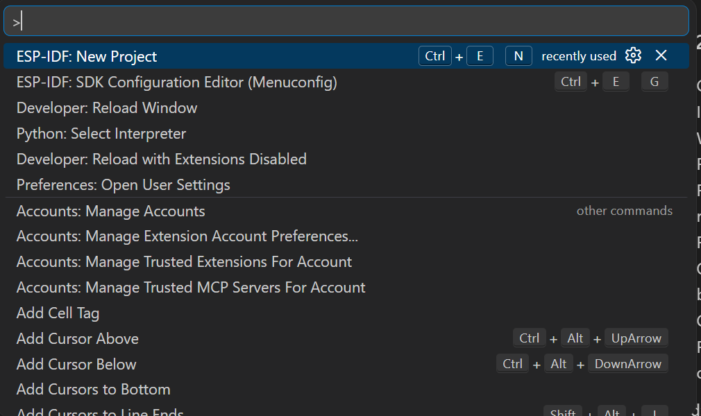

# Lab 3: WiFi, Wireshark, and CSI Collection **IoT**{: .label .label-iot }

Date: July 8  
Time: 1:00-5:00 PM  
TA: Shanmu Wang  
Hardware: three ESP32 boards per group: `softAP`, `injector`, and `sniffer`

## Goals

By the end of this lab, each group should be able to:

- explain WiFi frames, channels, RSSI, OFDM subcarriers, and channel state information (CSI);
- use Wireshark to inspect a captured WiFi packet trace;
- flash or verify three ESP32 firmware roles: access point, frame injector, and CSI sniffer;
- identify and record ESP32 serial ports, MAC addresses, and WiFi channels;
- visualize CSI amplitude over time and across subcarriers;
- implement a simple variance-based CSI motion detector;
- explain why WiFi sensing depends on multipath, geometry, motion, and interference.

## Lab Code

Use the WiFi lab repository as the source of truth:

[https://github.com/wshanmu/wifi_lab](https://github.com/wshanmu/wifi_lab)

Clone it once:

```bash
git clone https://github.com/wshanmu/wifi_lab.git
cd wifi_lab
```

Before lab, update to the latest version:

```bash
git pull
```

The main folders are:

| Path | Purpose |
| --- | --- |
| `softAP/` | ESP-IDF firmware for the ESP32 access point. |
| `injector/` | ESP-IDF firmware that transmits spoofed WiFi frames as the CSI stimulus. |
| `sniffer/` | ESP-IDF firmware that listens for the injector frames and streams CSI over USB serial. |
| `tools/` | Python live CSI plot and presence-detection tools. |
| `wireshark_example.pcap` | Example WiFi packet capture for the Wireshark demo. |

## System Overview

The lab uses three ESP32 roles.

```text
softAP creates WiFi link context
injector sends spoofed 802.11 frames
sniffer captures CSI from those frames and streams it over USB serial
```

CSI is richer than RSSI. RSSI is one received-power number. CSI gives amplitude and phase information for many OFDM subcarriers, so it changes when people move and alter the multipath reflections in the room.

## Before You Start

Each group should have:

- one ESP32 labeled `softAP`;
- one ESP32 labeled `injector`;
- one ESP32 labeled `sniffer`;
- USB data cables, not charge-only cables;
- VS Code with the ESP-IDF extension installed;
- Python 3.10+ and the packages in `tools/requirements.txt`;
- Wireshark installed.

If the boards are already pre-flashed by the TA, still read the firmware steps so you understand what each board is doing. You may only need to verify the serial output.

## Python Tool Setup

Open a terminal in the repository:

```bash
cd wifi_lab
```

Create and activate a Python environment.

macOS/Linux:

```bash
python3 -m venv .venv
source .venv/bin/activate
python -m pip install --upgrade pip
python -m pip install -r tools/requirements.txt
```

Windows PowerShell:

```powershell
python -m venv .venv
.\.venv\Scripts\Activate.ps1
python -m pip install --upgrade pip
python -m pip install -r tools\requirements.txt
```

Check the plotting tool without hardware:

```bash
python tools/plot_csi_serial.py --demo-signal
```

A window titled `ESP32 CSI Live Amplitude` should open.

## Find Serial Ports

Use your actual serial port in later commands.

macOS:

```bash
ls /dev/cu.usb* /dev/cu.SLAB* /dev/cu.wch* 2>/dev/null
```

Linux:

```bash
ls /dev/ttyUSB* /dev/ttyACM* 2>/dev/null
```

Windows:

```text
Open Device Manager -> Ports (COM & LPT), then look for the new COM port.
```

Useful examples:

- macOS: `/dev/cu.usbserial-5B1F0080901`
- Linux: `/dev/ttyUSB0`
- Windows: `COM5`

In VS Code, the ESP-IDF status bar also shows the selected serial port and target. Confirm these before flashing.


## Four-Hour Plan

### 1:00-1:25 PM - WiFi and CSI Concepts

The TA will introduce:

- **WiFi frame:** one structured packet on the wireless link.
- **Channel:** the frequency slice the radio uses, such as 2.4 GHz channel 1.
- **OFDM subcarrier:** a narrow frequency bin inside the WiFi channel.
- **RSSI:** one scalar received signal strength value.
- **CSI:** per-subcarrier channel response. We will use CSI amplitude for sensing.
- **Multipath:** reflected signal paths from walls, furniture, and people.

Key idea: when a person moves near the injector-sniffer link, the wireless channel changes. That motion can show up as higher CSI variance.

### 1:25-1:45 PM - Wireshark Frame Demo

Open the example capture:

```bash
wireshark wireshark_example.pcap
```

If that command does not work, open Wireshark first and use **File > Open**.

Find one beacon or data frame and inspect:

- frame type;
- source MAC address;
- destination MAC address;
- sequence number;
- channel or radio metadata if available.

Checkpoint question: what information is in the packet header before the actual data payload?

### 1:45-2:25 PM - Configure or Verify the SoftAP Board

The SoftAP board creates the WiFi network context for the link.

1. Open the `softAP/` folder in VS Code.
2. Connect the board labeled `softAP`.
3. Identify its serial port.
4. Open the ESP-IDF Command Palette with `Ctrl+Shift+P` or `Command+Shift+P`.



5. Open `ESP-IDF: SDK Configuration Editor (Menuconfig)`.
6. Search for WiFi settings and set the WiFi channel. Use channel `1` unless the TA assigns another channel.

You can also use the gear icon in the ESP-IDF toolbar to open configuration tools.


7. Run `ESP-IDF: Build, Flash and Start a Monitor on Your Device`.
8. Record the SoftAP MAC address and channel from the monitor output.


Record:

| Item | Value |
| --- | --- |
| SoftAP serial port |  |
| SoftAP MAC address |  |
| WiFi channel |  |

After the SoftAP is running, it can be powered from a USB power adapter.

### 2:25-3:00 PM - Configure or Verify the Injector Board

The injector board sends spoofed 802.11 frames to create packets that the sniffer can capture.

1. Open the `injector/` folder in VS Code.
2. Connect the board labeled `injector`.
3. Open `main/injector.c`.
4. Set bytes `4-9` and `16-21` in the packet to the SoftAP MAC address.


5. Set bytes `10-15` to a fake transmitter MAC address. Use a unique value for your group and write it down.


6. Set the injector WiFi channel to the same channel as the SoftAP:

```c
ESP_ERROR_CHECK(esp_wifi_set_channel(YOUR_CHANNEL, 0));
```

7. Run `ESP-IDF: Build, Flash and Start a Monitor on Your Device`.

Expected injector output includes `Starting injection...`.


Record:

| Item | Value |
| --- | --- |
| Injector serial port |  |
| Injector fake MAC address |  |
| Injector channel |  |

### 3:00-3:25 PM - Configure or Verify the Sniffer Board

The sniffer board listens on the same channel and streams CSI reports over USB serial.

1. Open the `sniffer/` folder in VS Code.
2. Connect the board labeled `sniffer`.
3. Open `main/sniffer.c`.
4. Set the injector fake MAC address:

```c
#define INJECTOR_SPOOFED_MAC "AA:BB:BB:BB:BB:BB"
```

5. Set the sniffer channel to the same channel:

```c
ESP_ERROR_CHECK(esp_wifi_set_channel(YOUR_CHANNEL, 0));
```

6. Run `ESP-IDF: Build, Flash and Start a Monitor on Your Device`.
7. Confirm that the monitor prints CSI lines with timestamp, RSSI, address, and many integer CSI values.


Record:

| Item | Value |
| --- | --- |
| Sniffer serial port |  |
| Sniffer listening MAC filter |  |
| Sniffer channel |  |

Checkpoint: show the TA one live CSI line before moving on.

### 3:25-3:50 PM - Live CSI Visualization

Run the live CSI plot from the repository root:

```bash
python tools/plot_csi_serial.py --port SNIFFER_PORT --baud 115200
```

Replace `SNIFFER_PORT` with your sniffer serial port.

Observe:

- heatmap: subcarrier index vs. time;
- selected subcarrier amplitude over time;
- RSSI in the status line.

Try these scenes:

| Scene | What to do |
| --- | --- |
| static | Keep the injector-sniffer area empty and still. |
| walk | Walk through the link path. |
| wave | Wave one arm near the link path. |

Question: which subcarriers visibly change when someone moves?

### 3:50-4:35 PM - Presence Detection Coding Task

Open:

```text
tools/csi_presence_detect.py
```

Complete `MotionDetector.update()`.

The intended logic is:

1. Append the newest CSI amplitude vector to `self.history`.
2. Wait until at least two vectors are available.
3. Stack recent vectors into a matrix.
4. Compute variance over time for each subcarrier.
5. Average those variances into one motion score.
6. Return `motion = score > self.threshold`.

Useful Python outline:

```python
if len(self.history) < 2:
    return {"score": 0.0, "motion": False}

matrix = np.stack(self.history, axis=0)
per_subcarrier_variance = np.var(matrix, axis=0)
score = float(np.mean(per_subcarrier_variance))
return {"score": score, "motion": score > self.threshold}
```

Run live:

```bash
python tools/csi_presence_detect.py --port SNIFFER_PORT --threshold 2.0 --window-size 20 --log present.txt
```

You can also test without hardware:

```bash
python tools/csi_presence_detect.py --demo-signal
```

Experiment:

- lower the threshold and watch for false positives;
- raise the threshold and watch for missed motion;
- change `--window-size` and observe latency vs. stability.

### 4:35-5:00 PM - Checkoff and Discussion

Show the TA:

1. SoftAP MAC address and channel.
2. Injector fake MAC address.
3. One live sniffer CSI line.
4. Live CSI heatmap or demo-signal plot.
5. Presence detector running with your completed `MotionDetector.update()`.
6. One threshold/window setting that worked reasonably well.

## Deliverables

Submit one short group note with:

1. Board table: serial port, role, MAC address, and channel.
2. Screenshot or photo of one live CSI line.
3. Screenshot of the CSI visualization or demo signal.
4. Your completed `MotionDetector.update()` code.
5. Short answers:
   - What changed in CSI when someone moved?
   - What threshold did you choose?
   - What caused false positives or false negatives?
   - How would room layout or other WiFi traffic affect the result?

## Troubleshooting

| Problem | Likely Cause | Fix |
| --- | --- | --- |
| Board not visible as a serial port | Charge-only cable or missing USB driver | Try a known data cable; check Device Manager or `/dev/cu.*`; ask a TA. |
| Flash fails | Wrong target, wrong port, or board not in bootloader mode | Select the right port; hold BOOT during connect if needed; ask a TA before erasing. |
| Sniffer prints no CSI | MAC filter or channel mismatch | Confirm injector fake MAC and channel match the sniffer configuration. |
| Live plot opens but stays blank | Wrong serial port or sniffer not streaming | Recheck `SNIFFER_PORT` and monitor output. |
| PyQt/PyQtGraph error | Python packages missing | Activate the environment and run `python -m pip install -r tools/requirements.txt`. |
| Detector never triggers | Threshold too high or too little motion near link | Lower `--threshold`, move closer to the injector-sniffer path, or increase motion. |
| Detector always triggers | Threshold too low or noisy environment | Raise `--threshold`, reduce nearby movement, or reposition boards. |

## Optional Extension

If time remains, record a 60-second still-person CSI log and look for small periodic amplitude changes from breathing. This is harder than motion detection because breathing creates a much smaller signal, but it uses the same CSI pipeline.
